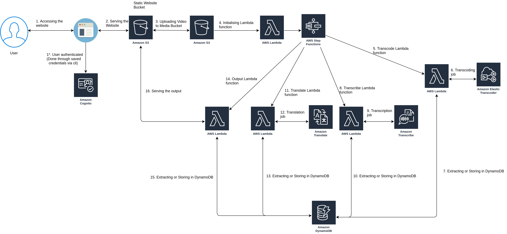

# Multilingual Subtitle Generator

Using AWS AI Services like Amazon Transcribe and Amazon Translate along with AWS elastic transcoder, Multilingual Subtitle Generation aims to provide subtitles to video files in multiple languages. As of now, the prototype is being provided as a Software as a Service but it can also be converted to Platform as a Service for multiple companies and industries like the Entertainment industry or the education companies like Byjus who's videos can be translated in multiple languages using this service.

## Flow Diagram



## How To Run

### Setting up

```bash
    cd cloudformation
    export USERNAME=<unique user id with only chars>
    ./create-all.sh
```

### Deleting stack

```bash
    cd cloudformation
    ./delete-all.sh
```

## AWS Services Used

* S3
* Cognito
* Lambda
* Step Function
* Amazon Translate
* Amazon Transcribe
* DynamoDB
* Amazon Elastic Transcoder

## Use Cases

* In Entertainment industry
* In Translating educational videos
* In Translating News channels
